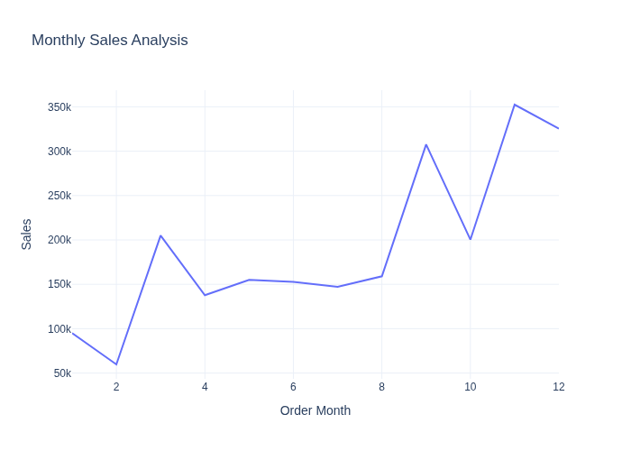
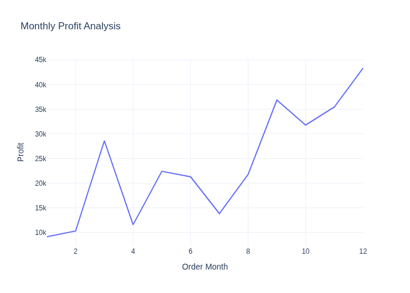

# superstore-sales-analysis
Superstore Sales &amp; Profit Analysis | EDA using Python, Pandas &amp; Plotly with business insights.


# Superstore Sales & Profit Analysis

## Executive Summary

This project performs an end-to-end Exploratory Data Analysis (EDA) on a retail Superstore dataset to uncover insights related to sales performance, profitability trends, and customer segment behavior.  
The analysis identifies high-performing categories, seasonal trends, and efficiency gaps using Sales-to-Profit ratio.

---

## Project Objective

The main objective of this analysis is to:

- Calculate monthly sales and identify highest and lowest performing months.
- Analyze sales performance by category and sub-category.
- Evaluate monthly profit trends.
- Compare profit performance across categories.
- Analyze sales and profit distribution by customer segment.
- Calculate and interpret Sales-to-Profit ratio to assess business efficiency.

---

## Key Performance Indicators (KPIs)

- Total Sales
- Total Profit
- Highest Sales Month
- Highest Profit Month
- Top Performing Category
- Most Profitable Segment
- Sales-to-Profit Ratio

---

## Analysis Performed

### 1. Monthly Sales Analysis
Identified the highest and lowest sales months and observed seasonal trends.

### 2. Category-Level Sales Analysis
Determined which category generates the highest and lowest revenue.

### 3. Sub-Category Sales Analysis
Analyzed detailed product-level sales performance.

### 4. Monthly Profit Analysis
Identified the month with the highest overall profit.

### 5. Profit by Category & Sub-Category
Compared profitability across different product hierarchies.

### 6. Sales & Profit by Customer Segment
Evaluated performance across Consumer, Corporate, and Home Office segments.

### 7. Sales-to-Profit Ratio Analysis
Calculated efficiency ratio to detect high-sales but low-profit areas.

---

## Key Insights

- Sales show strong growth toward the last quarter of the year.
- Technology category generates the highest overall revenue.
- Some sub-categories generate high sales but relatively low profit.
- Consumer segment contributes the largest share of total sales.
- Sales-to-Profit ratio highlights efficiency gaps in certain areas.

---

## Tools & Technologies Used

- Python
- Pandas
- Plotly
- VS Code

---

## Visualizations







---

## How to Run the Project

1. Clone the repository
2. Install dependencies:
   ```
   pip install -r requirements.txt
   ```
3. Run the Jupyter notebook

---

## Business Recommendations

- Focus marketing strategies on high-performing categories.
- Re-evaluate pricing for sub-categories with low profit margins.
- Improve cost control in underperforming segments.
- Prepare inventory planning for high-demand seasonal months.

---

## Author

Nisith Khawas
